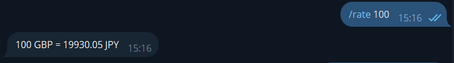

# Currency Converter Bot
The Currency Converter Bot is a Telegram bot that allows users to convert currencies and retrieve exchange rates. It is built using Java and the Spring Framework, and utilizes the ngrok tunneling service for exposing the bot to the internet.
- Link to DockerHub: https://hub.docker.com/repository/docker/michailivanov/currency-converter-bot
- Link to TelegramBot: https://t.me/CurrencyCoBot

# Architecture
The Currency Converter Bot follows a typical Spring Framework architecture:
- Application: The main class that initializes the Spring application context and starts the bot.
- ApplicationConfig: Configuration class for the Spring application.
- WebhookController: Controller class that handles incoming webhook updates from Telegram.
- MyBot: The main bot class that processes user messages and interacts with the Telegram API.
- DatabaseConfig: Configuration class for the database connection.
- DatabaseService: Service class for performing database operations.

## Features

1. Start
- `/start` - Receive a greeting message.


2. Help
- `/help` - Get help and information about all available commands.


3. Sign up 
- `/signup <username> <password> <fromCurrency> <toCurrency>` - Register a new account.


4. Sign in 
- `/login <username> <password>` - Log in to an account.
- `/logout` - Log out of the current account.


5. Preferences 

- Home currency 
  - `/home` - Display the current home currency.
  - `/chhome <currency>` - Change the home currency to a different one.
  


- Default pair
  - `/pair` - Show the default currency pair.
  - `/chpair <fromCurrency> <toCurrency>` - Modify the default currency pair.


  
6. Converter
- Request Exchange rate
- Convert with specified amount

`/rate <fromCurrency> (optional) <toCurrency> (optional) <amount> (optional)`

If nothing set - default pair used:
    


If one currency specified - compare with Home currency:


If two currencies specified - show their exchange rate


If nothing set  - default pair used:



If one currency specified with specified amount - compare with Home currency:


If two currencies specified with specified amount - show their exchange rate:


`/rate <fromCurrency> (optional) <toCurrency> (optional) <amount> (optional)`
7. History
- Show all requests for a specified period
- Show requests for a specified currency/pair for a period

  `/history <dateFrom> (optional 1) <dateTo> (optional 1) <currency1> (optional 2) <currency2> (optional 3)`


# Prerequisites
Before running the Currency Converter Bot, ensure that you have the following:

- Java Development Kit (JDK) 21 or higher
- Apache Maven
- Docker
- ngrok authtoken

# Dependencies
The Currency Converter Bot uses the following main dependencies:
- Spring Framework: For dependency injection and application configuration.
- Spring WebFlux: For building reactive web applications.
- Telegram Bots API: For interacting with the Telegram Bot API.
- ngrok: For exposing the bot to the internet via a tunnel.
- H2 Database: For storing user preferences and conversion history.

# How to build the project:
## Create following files (hidden since they contain **private tokens**):

- Set `<YOUR_TELEGRAM_BOT_TOKEN>`, `<YOUR_CURRENCYAPI_TOKEN>` to your tokens in `src/main/resources/application.properties`.

- Set `<YOUR_NGROK_AUTHTOKEN>` in `Dockerfile`.

### `src/main/resources/application.properties`
```
bot.token=<YOUR_TELEGRAM_BOT_TOKEN>

currenciesRateApiUrl=https://currencyapi.net/api/v1/rates?key=<YOUR_CURRENCYAPI_TOKEN>&output=JSON

spring.datasource.url=jdbc:h2:mem:testdb
spring.datasource.username=sa
spring.datasource.password=
```
### `Dockerfile`(inside the root of the project)
```
FROM openjdk:21-slim-buster

# Install ngrok
RUN apt-get update && apt-get install -y wget unzip && \
    wget https://bin.equinox.io/c/bNyj1mQVY4c/ngrok-v3-stable-linux-amd64.tgz && \
    tar -xvzf ngrok-v3-stable-linux-amd64.tgz && \
    mv ngrok /usr/local/bin/ && \
    rm ngrok-v3-stable-linux-amd64.tgz

# Set the ngrok authtoken
ENV NGROK_AUTHTOKEN=<YOUR_NGROK_AUTHTOKEN>

# Copy your application JAR file
COPY target/CurrencyConverterBot-1.0-SNAPSHOT-jar-with-dependencies.jar /app.jar

# Expose the port on which your application runs
EXPOSE 8081

# Start ngrok and your application
CMD ngrok config add-authtoken $NGROK_AUTHTOKEN && ngrok http 8081 & java -jar /app.jar
```
## Build the project using Maven, build the Docker image, run the Docker container: 
`mvn clean package ; docker build -t currency-converter-bot . ; docker run -p 8080:8080 currency-converter-bot`

If everything goes well you will see: 
```
Server started on port 8081
```

The bot should now be running and accessible to convert currencies in telegram.


